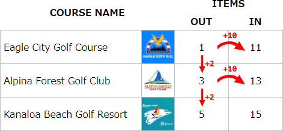

# NewみんなのGOLF アイテム所在ホール一覧化ツール


[English](README.md).

## About
PS4ゲーム <a href="https://www.playstation.com/ja-jp/games/everybodys-golf/" target="_blank">NewみんなのGOLF<a>にて、オープンコース上のコインや宝石が出現しているホールを一覧表示するツールです。

動作確認は <a href="https://TheFabulousPika.github.io/everybodys-golf-coins-and-gems-locator/" target="_blank">こちら<a>

## 開発者メモ
### 出現法則など
* オンラインコースはDLCを含め10個。各コースは18ホールが前後半に分割され、アウト(1-9)とイン(10-18)の２つのマップから構成される。 各マップ上で特定のホールのエリアにコイン、宝石、ゴルフボール、ワープメダルなどのアイテムが出現する。以降、便宜的にこのホールのことを「アイテムホール」と呼ぶ。

* アウトマップにてN番ホールがアイテムホールだったときに、対応するインマップのN+10番ホールもまたアイテムホールとなる。N+10が18を超えた場合、10からまた始まって溢れた分が繰り越される。

<p align=center></p>

* コース選択画面上でひとつ下のコースに移動するたびに、アイテムホールの番号が2ずつ増えていく。2を加えた数がそのマップのホール番号の上限（アウトなら9、インなら18）を超えた場合に、ホール番号がはじめに戻って溢れた分が繰り越される。

* ゲーム内のイベントの開始終了は「みんGOL時間」の示す時刻によって管理されている。みんGOL時間はGMT（グリニッジ標準時）と同一。ラッキータイムは2時間おきに時刻00分から開始される。みんGOL時間の日付が変わるとアイテムホールが次のホールに移動し、アイテム配置が初期化される。

## 制約事項など
* 長期サーバーメンテナンスなどで、本ツールと実際のオープンコース上のアイテムホール番号でズレが発生することを確認しています。その場合はindex.jsの11行目で下駄を履かせて調整する必要があります：
```
L11 var EagleOutHoleNumber = 4 + remainder;
```
