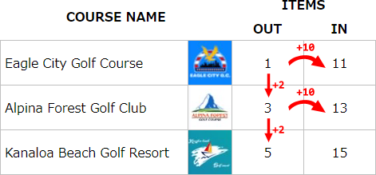

# Everybody's Golf Coins and Gems Locator


[日本語](README.jp.md)

## About
A tool for locating the holes that coins and gems appear on for each online golf course in the PS4 game <a href="https://store.playstation.com/en-us/product/UP9000-CUSA04687_00-EVERYBODYSGOLFUS" target="_blank">Everybody's Golf</a>.

Demo available <a href="https://TheFabulousPika.github.io/everybodys-golf-coins-and-gems-locator/" target="_blank">here<a>

## Development notes
### Game logic
* There are a total of ten courses available for online play, including DLC. Each course is divided into two maps that contain either the "Out" (1-9) or "In" (10-18) holes.
Game items such as coins, gems, special golf balls, and warp medals will spawn in the area of a certain hole (henceforth "item hole") on each map.

* If hole N is the item hole on a particular "Out" map, the hole number N+10 on the corresponding "In" map will also be an item hole. If N+10 goes over 18, the count will restart from 10 with the excess being carried over.

<p align=center></p>

* The item hole number will increment by 2 when moving down the courses as they are listed on the course selection screen. If adding 2 to the previous item hole number will place it over the maximum for the map type (i.e. 9 for "Out" and 18 for "In"), the count will loop back to the beginning with the excess being carried over.

* Events are scheduled in the game according to Golf Island Time, which is the same as GMT. Lucky Chance is triggered at the top of the hour every two hours. Upon day change, maps will be reinitialized and the item hole will move to the next hole on each map.

## Limitations
* From time to time the item hole progression logic will be disrupted by prolonged server maintenance or other factors. In such cases this tool will have to be resyncronized by changing the increment found on L11 of of index.js:
```
L11 var EagleOutHoleNumber = 4 + remainder;
```
